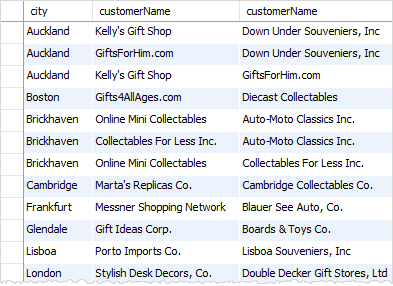
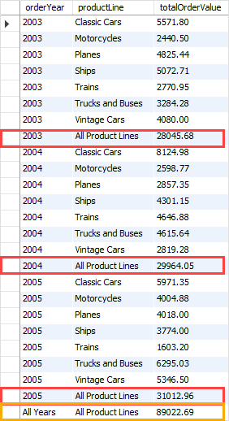

[toc]

# function

1. NOW()

   ```mysql
   SELECT NOW();
   ```

2. CONCAT()

   ```mysql
   SELECT CONCAT('John',' ','Doe');
   ```

3. FIELD()

   1. syntax

      ```mysql
      FIELD(str, str1, str2, ...)
      ```

   2. ```mysql
      SELECT FIELD('A', 'A', 'B','C');
      # output: 1
      ```

   3. example

      ```mysql
      SELECT 
          orderNumber, status
      FROM
          orders
      ORDER BY FIELD(
          	status,
              'In Process',
              'On Hold',
              'Cancelled',
              'Resolved',
              'Disputed',
              'Shipped')
      limit 20;
      ```

4. IFNULL()

   1. syntax

      ```mysql
      IFNULL(CONCAT(m.lastname, ', ', m.firstname),
                  'Top Manager') AS 'Manager'
      ```

5. YEAR()


# tips

1. In `MySQL`, `NULL` is lower than non-NULL values

2. `where operator`

   1. AND

   2. OR

   3. BETWEEN

      - ```mysql
        BETWEEN a AND b
        ```

        

   4. LIKE

      - The `%` wildcard matches any string of zero or more characters while the `_` wildcard matches any single character.

   5. IN

      - ```mysql
        value IN (value1, value2,...)
        ```

   6. IS NULL

   7. comparison operators

      - =
      - <> or !=
      - <
      - <=
      - `>=`

   8. NOT 

3. Use the `MySQL` `DISTINCT` clause to remove duplicate rows from the result set returned by the `SELECT` clause.

4. `MySQL` evaluates the `OR` operator after the `AND` operator if an expression contains both `AND` and `OR` operators.

5. Use parentheses to change the order of evaluation.

6. Use `ESCAPE` clause specifies an escape character other than the default escape character (`\`).

7. limit

   ```mysql
   # syntax
   SELECT 
       select_list
   FROM
       table_name
   LIMIT [offset,] row_count;
   ```

8. 如果column name相同可以使用USING(column_name)

9. 自关联查询可以使同一张表展现更丰富格式的数据

   1. ```mysql
      SELECT 
          c1.city, 
          c1.customerName, 
          c2.customerName
      FROM
          customers c1
      INNER JOIN customers c2 ON 
          c1.city = c2.city
          AND c1.customername > c2.customerName
      ORDER BY 
          c1.city;
      ```

      

10. sql基本执行流程

11. Use the MySQL `HAVING` clause with the `GROUP BY` clause to specify a filter condition for groups of rows or aggregates.

12. ROLLUP

    1. ```mysql
       #syntax
       GROUP BY c1, c2, c3 WITH ROLLUP
       ```

    2. The `ROLLUP` assumes that there is the following hierarchy:

       ```mysql
       c1 > c2 > c3
       ```

    3. And it generates the following grouping sets:

       ```mysql
       (c1, c2, c3)
       (c1, c2)
       (c1)
       ()
       ```

       

# example

1. cross join 

   1. 

   2. ```mysql
      SELECT 
          b.store_name,
          a.product_name,
          IFNULL(c.revenue, 0) AS revenue
      FROM
          products AS a
              CROSS JOIN
          stores AS b
              LEFT JOIN
          (SELECT 
              stores.id AS store_id,
              products.id AS product_id,
              store_name,
                  product_name,
                  ROUND(SUM(quantity * price), 0) AS revenue
          FROM
              sales
          INNER JOIN products ON products.id = sales.product_id
          INNER JOIN stores ON stores.id = sales.store_id
          GROUP BY stores.id, products.id, store_name , product_name) AS c ON c.store_id = b.id
              AND c.product_id= a.id
      ORDER BY b.store_name;
      	
      		
      		
      # 目标：查出某个商店没有卖出的商品
      		
      # 1. 查询每个商店和商品的关系（corss join 获取商品和商店的笛卡尔积）-> a
      		
      # 2. 在sales表中查询不同商品在不同商店中卖出的总价 -> b
      # 3. a left join b 为空的地方即为某个商店没有没出的商品
      
      select * from
      
      (select
      	store_id,
      	product_id,
      	round(sum(quantity * price), 0) as revenue
      from sales
      join products	on products.id = sales.product_id
      GROUP BY store_id, product_id) as a
      
      right join 
      
      (select p.id as product_id, s.id as store_id, store_name, price, product_name
      from products p 
      CROSS join stores s) as b
      
      on a.store_id = b.store_id and a.product_id = b.product_id;
      
      ```

   2. group by

      1. ```mysql
         # group rows by expressions. The following query gets the total sales for each year.
         SELECT 
             YEAR(orderDate) AS year,
             SUM(quantityOrdered * priceEach) AS total
         FROM
             orders
         INNER JOIN orderdetails 
             USING (orderNumber)
         WHERE
             status = 'Shipped'
         GROUP BY 
             YEAR(orderDate);
         ```

   3. ROLLUP & IF & GROUPING

      - The `GROUPING()` function returns 1 when `NULL` occurs in a supper-aggregate row, otherwise, it returns 0.

      - ```mysql
        SELECT 
            IF(GROUPING(orderYear),
                'All Years',
                orderYear) orderYear,
            IF(GROUPING(productLine),
                'All Product Lines',
                productLine) productLine,
            SUM(orderValue) totalOrderValue
        FROM
            sales
        GROUP BY 
            orderYear , 
            productline 
        WITH ROLLUP;
        ```

        

      

   

   

